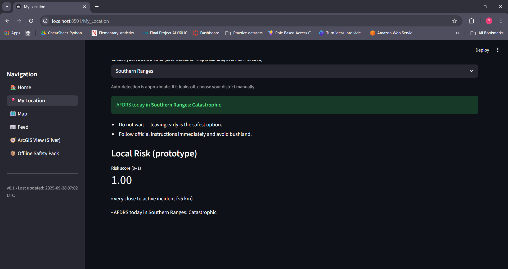

# Outback_Early_Warning 🔥🌊

**AI in the Outback Hackathon Submission (2025)**  
A collaborative project by **Yash Singh** and **Trusha Sonawane**

---

## Overview
Outback_Early_Warning is a **Streamlit-based early-warning dashboard** designed for rural and regional Australians.  
It combines **official data feeds** (NSW Rural Fire Service, Bureau of Meteorology, AFDRS) with an **AI-driven local risk score** and **ArcGIS interoperability** to help communities **prepare, respond, and stay safe** during bushfires, floods, and severe weather.

---

## ✨ Key Features
- **📍 My Location**: Enter any NSW town/postcode → get a **personalized risk score** with **transparent “why” tags** and today’s **AFDRS Fire Danger Rating** (plus plain-English safety actions).
- **🗺️ Map**: Unified live layers (NSW RFS incidents, BOM warnings, optional NASA FIRMS hotspots), hover tooltips with **status + updated time**, **layer toggles**, and adjustable **marker size**. Includes a **color legend** (red/orange/green).
- **📰 Unified Feed**: Sorted and filterable feed across RFS + BOM, with normalized status and official links.
- **📦 Offline Safety Pack**: One-click PDF + CSV download of critical contacts and checklists for low-connectivity areas.
- **🧭 ArcGIS Gold Integration**: Export incidents as GeoJSON with UTC timestamp → upload to ArcGIS Online → embed a **live Web Map** or **Hosted Feature Layer / GeoJSON URL** directly in-app using the ArcGIS JavaScript API.
- **⚡ Optimized for rural connectivity**: Low-bandwidth toggle, caching, and refresh controls.

---

## Tech Stack
- **Frontend**: Streamlit, PyDeck  
- **Backend**: Python, Requests, CacheTools  
- **Geospatial**: ArcGIS Online (Gold), GeoJSON export, NASA FIRMS  
- **Data Sources**: NSW RFS, Bureau of Meteorology, AFDRS  
- **Collaboration**: GitHub, VS Code, pair programming  

---

## Team
- **Yash Singh** — Data pipelines, geospatial risk model, ArcGIS integration, co-designed Streamlit UI and offline resources.  
- **Trusha Sonawane** — Data ingestion, feed normalization, UI/UX design, authored Offline Pack, co-led demo prep and ArcGIS workflows.  

> We worked together across *all aspects* of the project — backend + frontend + UX — ensuring true end-to-end collaboration.

---

## Getting Started
Clone and run locally:

```bash
git clone https://github.com/singhyash2209/Outback_Early_Warning.git
cd Outback_Early_Warning
python -m venv .venv
.venv\Scripts\Activate.ps1   # on Windows
pip install -r requirements.txt
streamlit run Home.py
```
## Screenshots / Demo

### 🏠 Home Page


### 📍 My Location (Catastrophic Example)


### 📍 My Location (High Example)


### 🗺️ Map


### 📰 Unified Feed


### 🧭 ArcGIS View


### 📦 Offline Pack


## Demo Mode

To ensure a smooth demo (especially during judging), the app can run in **demo mode**.  
This mode uses a curated dataset that guarantees coverage of:

- AFDRS ratings: Catastrophic, High, Moderate
- Multiple active incidents across NSW
- Populated feed items (Bushfire, Flood, Severe Weather)

### Why demo mode?
Live feeds (RFS, BOM, AFDRS) are sometimes empty or unavailable. Demo mode makes sure all features are visible in action, while production mode connects directly to official data sources.

### How to run in demo mode
1. Download the demo file from `/data/demo_nsw_rfs_incidents.json` (included in repo).  
2. Start the app with:

```bash
streamlit run Home.py -- --demo
```

## Disclaimer

- This is a prototype built for the AI in the Outback Hackathon.
- It aggregates official data but is not an official warning service.
- Always follow directions from the NSW Rural Fire Service and Bureau of Meteorology.
