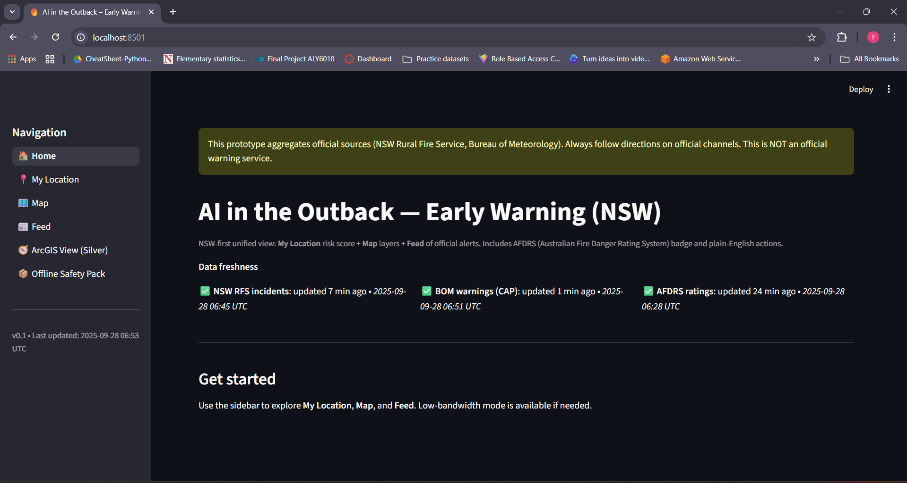
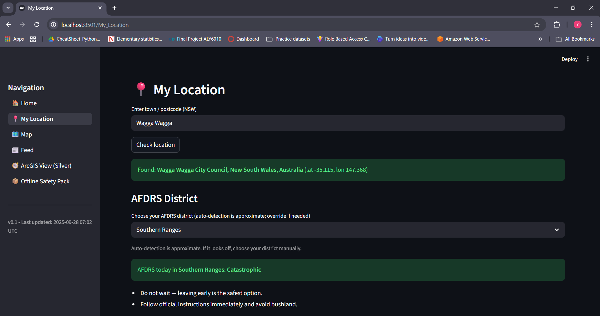
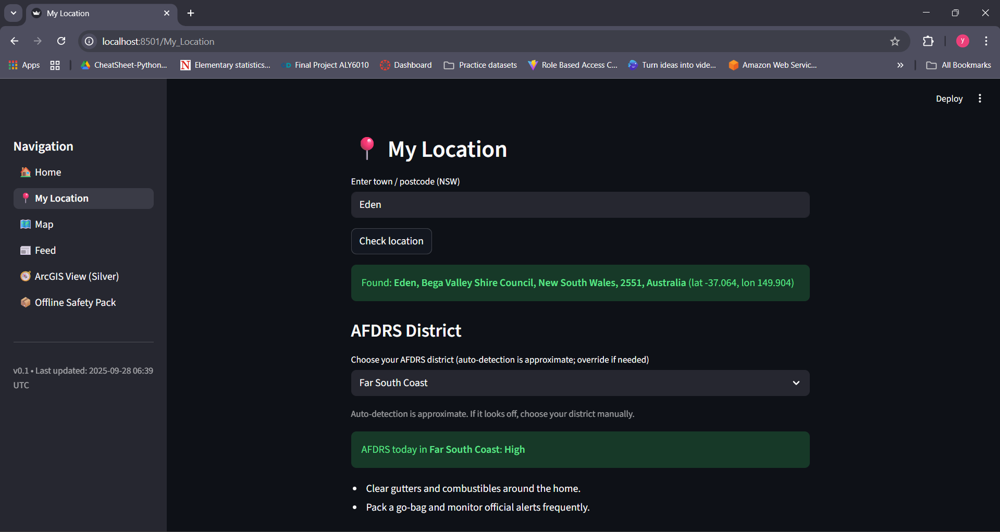
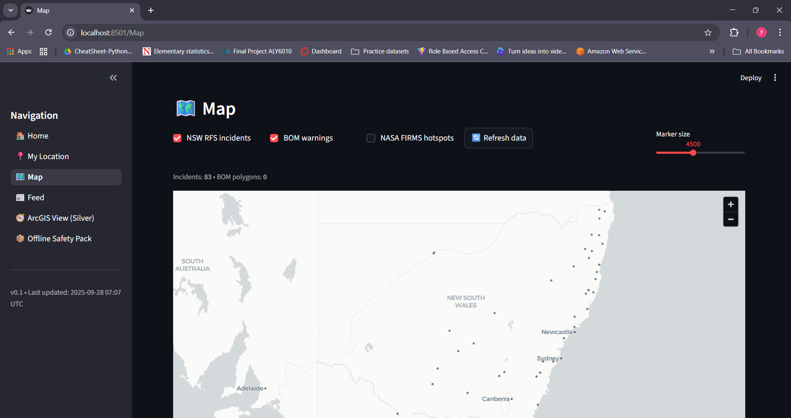
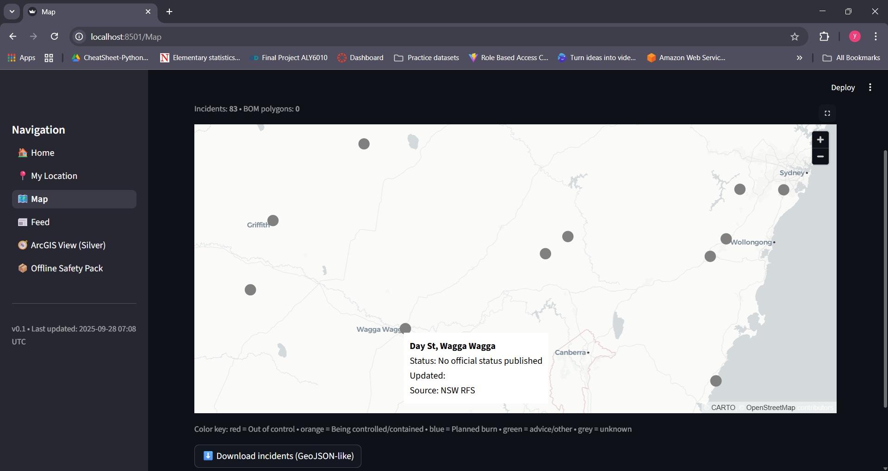
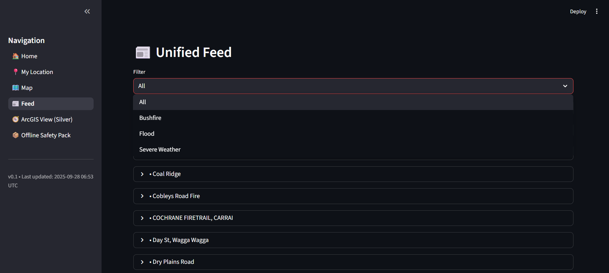
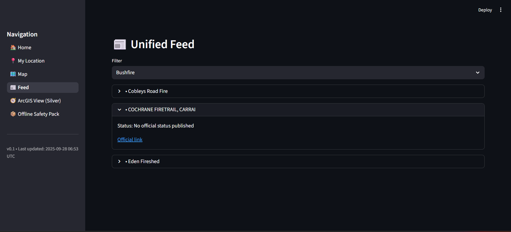
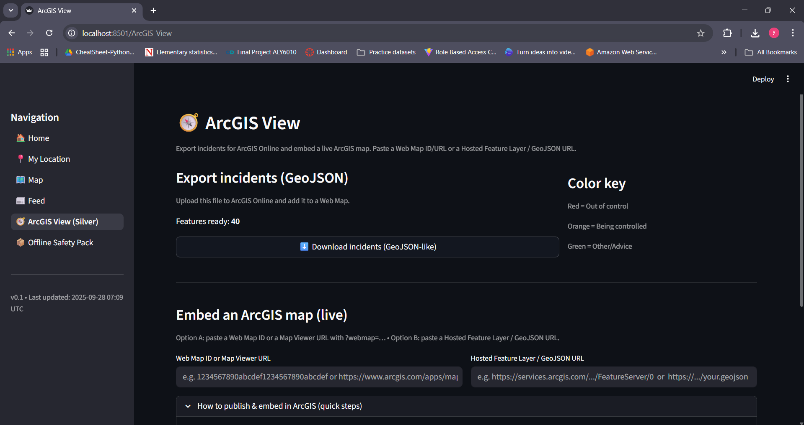
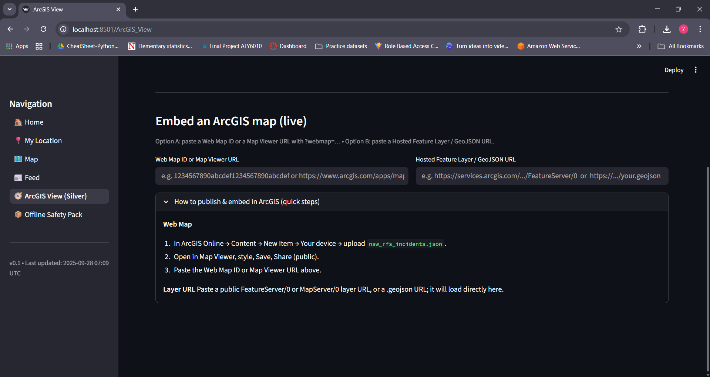
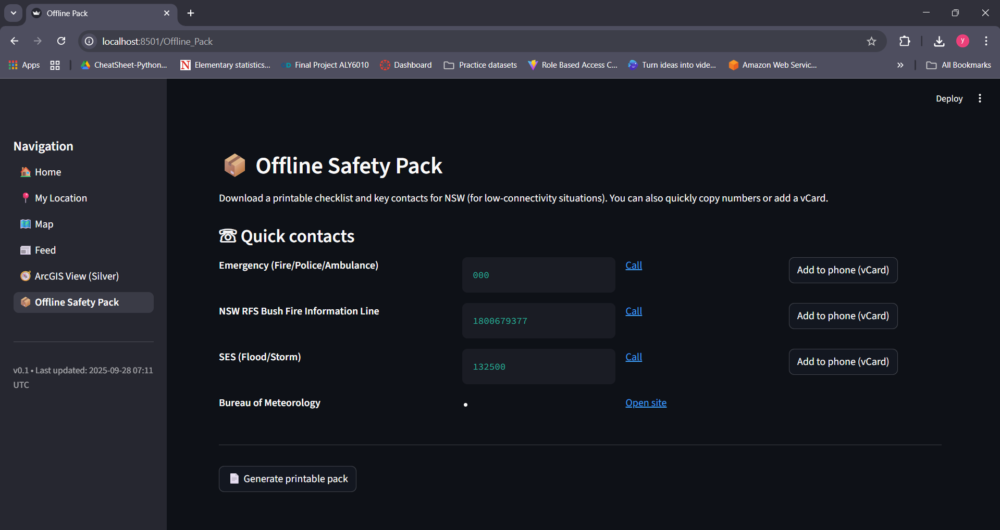

# AI in the Outback — Early Warning (NSW) 🔥

A one-stop, NSW-first dashboard that unifies **official bushfire, weather, and AFDRS feeds** into a simple, fast UI — with **offline-ready safety tools** and **ArcGIS export**.

**Demo video:** [Watch on Youtube](https://youtu.be/CYK1DZcK1wc)  
**Live app:** [outback-early-warning.streamlit.app](https://outback-early-warning.streamlit.app)  
**Repository:** [GitHub](https://github.com/singhyash2209/Outback_Early_Warning)

> ⚠️ **Disclaimer**: This is a prototype that aggregates **official sources** (NSW Rural Fire Service, Bureau of Meteorology, AFDRS). Always follow directions from official channels. **This is NOT an official warning service.**

---

## ✨ Features

- **Home**: Data freshness badges for NSW RFS, BOM warnings, and AFDRS.
- **My Location**: Enter a town/postcode → auto-detect AFDRS district → see today’s AFDRS rating (High, Extreme, Catastrophic, etc.) and a **local risk score (0–1)** with plain-English safety actions.
- **Map**: Interactive map of NSW incidents:
  - NSW RFS incidents (color-coded)
  - BOM warning polygons
  - NASA FIRMS hotspots (toggle on/off)
  - Legend + export as **GeoJSON-like**
- **Feed**: Unified alerts feed with filters (Bushfire, Flood, Severe Weather). Expand items for details and official links.
- **ArcGIS View**: Export incidents as GeoJSON and embed in ArcGIS Online. (Gold feature ✨)
- **Offline Safety Pack**: Quick contacts + printable checklist (low-connectivity mode).

**Color key:**  
🔴 Out of control • 🟠 Being controlled • 🔵 Planned burn • 🟢 Advice/other • ⚪ Unknown

---

## Screenshots

| Home | My Location (Catastrophic) | My Location (High) |
|------|-----------------------------|---------------------|
|  |  |  |

| Map (top) | Map (bottom + legend) |
|-----------|------------------------|
|  |  |

| Feed (filter) | Feed (expanded) |
|---------------|-----------------|
|  |  |

| ArcGIS export | ArcGIS embed | Offline Safety Pack |
|---------------|--------------|----------------------|
|  |  |  |

---

## Quick Start (Local)

```bash
# 1. Clone the repo
git clone https://github.com/singhyash2209/Outback_Early_Warning
cd Outback_Early_Warning

# 2. Create and activate a virtual environment (optional but recommended)
python -m venv .venv
# Windows
.venv\Scripts\activate
# macOS/Linux
source .venv/bin/activate

# 3. Install dependencies
pip install -r requirements.txt

# 4. Run the app
streamlit run Home.py
```
Open http://localhost:8501 in your browser.

---

## How to Use

- Home: Check if data feeds are fresh (RFS, BOM, AFDRS).
- My Location: Type a town (e.g., Eden, Cooma, Wagga Wagga) → confirm AFDRS district → view today’s rating + risk score.
- Map: Toggle layers (RFS, BOM, FIRMS). Hover markers for tooltips. Export GeoJSON for GIS.
- Feed: Use dropdown filter → expand any item → click Official link.
- ArcGIS View: Download nsw_rfs_incidents.json, upload to ArcGIS Online, style + embed.
-Offline Safety Pack: Copy key contacts, save a vCard, or print the pack.

---

## Tech Stack

- UI: Streamlit (Python)
- Mapping: Pydeck / deck.gl (Carto basemap)
- Data Sources:
  - NSW RFS incidents feed
  - Bureau of Meteorology (BOM CAP XML)
  - AFDRS daily ratings
  - NASA FIRMS hotspots
- Export: GeoJSON-like with timestamp + null-coordinate filtering
- Caching: cachetools.TTLCache for fast refresh

---

## Project Structure
.
├── Home.py
├── pages/
│   ├── 1_My_Location.py
│   ├── 2_Map.py
│   ├── 3_Feed.py
│   ├── 4_ArcGIS_View.py
│   └── 5_Offline_Pack.py
├── src/
│   ├── fetch_rfs_nsw.py
│   ├── fetch_bom.py
│   ├── afdrs.py
│   ├── fetch_firms.py
│   ├── geo_utils.py
│   ├── risk_model.py
│   ├── utils_cache.py
│   └── sidebar.py
├── assets/               # screenshots
├── requirements.txt
└── .streamlit/config.toml

---

## Team

- Yash Singh - Core Streamlit app, data integrations (RFS/BOM/AFDRS), map, feed, export, repo.
- Trusha Sonawane - AFDRS risk modeling & UI copy, Offline Safety Pack, UX polish, documentation/demo.

---

## License

This project is licensed under the MIT License — see the LICENSE
 file for details.

---

## What’s Next

- Deploy to additional platforms (e.g., Hugging Face Spaces).
- Add SMS/email/push alerts.
- Extend to all Australian states (not just NSW).
- Pilot with local councils and emergency services.

---
